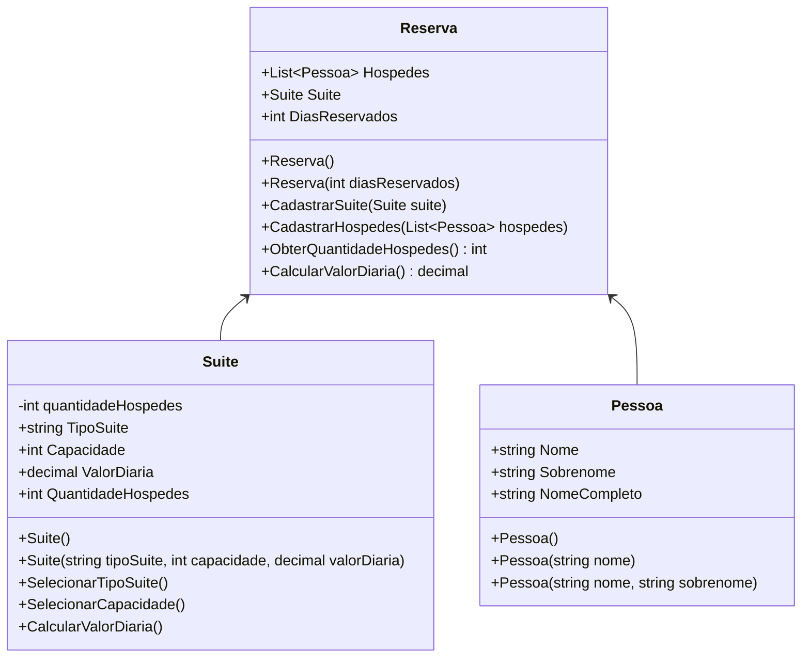

# Construindo um Sistema de Hospedagem de um Hotel no C#

Neste projeto de sistema de hospedagem, criado para um desafio da DIO, foi realizado um fork do repositório GitHub da Digital Innovation One (digitalinnovationone/trilha-net-explorando-desafio), onde o projeto já veio quase pronto. Como percebi que a saída que o Professor Buta desejava era "Premium", capacidade, valorDiaria, modifiquei vários métodos para criar e fazer com que o usuário pudesse escolher os quartos que deseja reservar, no qual cada quarto tem um valor e capacidade de hóspedes diferentes. Com o quarto escolhido, o usuário digita a quantidade de hóspedes, e a partir daí é calculado o valor da diária do quarto vezes a quantidade de hóspedes. Para que isso pudesse ocorrer, implementei na classe Suite mais um atributo: "QuantidadeHospedes".

Ficou assim: três classes principais: Pessoa, Reserva e Suite.

Na classe Pessoa, não modifiquei nada.

Na classe Suite, trabalhei com atributos como tipo de suíte, capacidade, valor da diária e quantidade de hóspedes. Utilizei um método SelecionarTipoSuite com um loop while que continua executando até o usuário escolher uma opção válida entre Premium, Luxo ou Standard. Dentro deste método, usei um switch case para atribuir os valores e capacidade de hóspedes específicos de cada tipo de suíte. No método SelecionarCapacidade, implementei um while com tratamento de exceções usando try-catch para garantir que a quantidade de hóspedes não exceda a capacidade máxima da suíte. Usei if para validar se a quantidade desejada é válida e throw new ArgumentException para lançar exceções personalizadas quando necessário.

Na classe Reserva, o método CalcularValorDiaria é o mais complexo, onde usei um while true com tratamento de exceções para garantir que o usuário digite um número válido de dias. Implementei if para verificar se a reserva tem mais de 10 dias e aplicar o desconto de 10%, e usei múltiplos blocos catch para tratar diferentes tipos de exceções, como FormatException e Exception genérica.

Em todos os métodos, utilizei Console.WriteLine para interagir com o usuário e Console.ReadLine para capturar entradas, criando uma interface interativa via console. O tratamento de exceções foi implementado de forma abrangente para garantir que o sistema não quebre com entradas inválidas do usuário, proporcionando uma experiência robusta e amigável.
# Diagrama 
